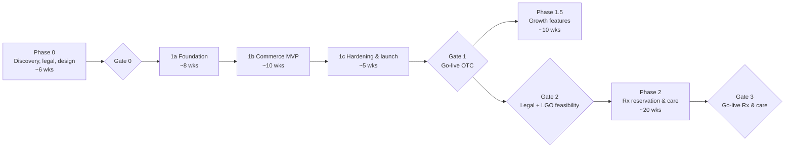

# Roadmap

Durations assume a core team of ~4–6 people (see [team & budget](../08-project/team-budget-and-delivery.md)).
Each phase ends with a **gate**: explicit go/no-go criteria signed off by the pharmacist-titular
(legal responsibility) and the tech lead.

---

## Phase 0 — Discovery, legal & design (~6 weeks)

**Objective:** remove the big unknowns before writing production code.

| Track | Deliverables |
|---|---|
| Legal & compliance | Legal opinion on online OTC sale, advertising, discounts/loyalty, returns, delivery; FAMHP + Order notification checklist; DPO appointed; DPIA v1; record of processing (RoPA) v1 |
| Business | Product range & pricing policy; delivery & pickup policy; service hours for pharmacist review; KPIs baselined |
| Vendors | LGO vendor: integration options (API, file export, HL7/FHIR?, DB views); Medipim contract; PSP onboarding (pharmacy acceptance confirmed); carrier contracts (bpost / PostNL / DHL via Sendcloud) |
| Design | Brand identity (logo, photography direction), design tokens, key screens (home, PLP, PDP, cart, checkout, account, review queue), usability test with 5–8 users |
| Tech | Repo, CI, environments, cloud accounts, ADRs accepted, walking skeleton deployed to staging (login → empty catalogue → health check) |

**Gate 0 criteria**
- [ ] Legal opinion confirms Phase 1 scope (or lists changes).
- [ ] LGO integration path known (API / export / none → fallback manual stock sync).
- [ ] PSP and Medipim contracts signed or in final review.
- [ ] Design system v1 + key screens approved.
- [ ] Walking skeleton live on staging with CI/CD.

---

## Phase 1a — Foundation (~8 weeks)

Build the platform core that both apps and both phases depend on.

- Monorepo, shared packages (`ui`, `db`, `auth`, `i18n`, `config`, `observability`).
- Auth: customer accounts, staff accounts with passkeys/TOTP, RBAC, session management.
- Audit log (append-only, hash-chained), consent store, data-subject request tooling skeleton.
- Catalogue module: CNK-based products, Medipim import, categories, multilingual content.
- Inventory module: stock ledger, locations, reservations, LGO sync (or manual import fallback).
- Back-office shell (`platform` app): navigation, roles, product & stock screens.
- Observability baseline, backups + restore drill #1, security headers, dependency scanning.

## Phase 1b — Commerce MVP (~10 weeks)

- Storefront: home, category/listing with facets, search, PDP (leaflet, warnings, usage), cart.
- Checkout: guest + account, addresses, delivery options, Bancontact/cards/wallets via PSP.
- Pharmacy rules engine: quantity limits, age gates, questionnaires, "requires pharmacist review".
- Pharmacist review queue (approve / contact customer / refuse & refund).
- Fulfilment: pick list, packing, shipping labels (Sendcloud or carrier API), tracking emails.
- Pricing & VAT (6 % / 21 % per product), invoices (PDF + Peppol-ready for B2B).
- CMS for pages & health articles (with pharmacist review workflow).
- Transactional emails/SMS in 4 languages; legal pages; cookie consent.

## Phase 1c — Hardening & launch (~5 weeks)

- Accessibility audit (WCAG 2.2 AA) and fixes; performance budget met.
- External penetration test; fix all high/critical findings.
- Load test (peak = 10× expected launch traffic).
- DR test: restore from backup into a clean environment within RTO.
- FAMHP notification & listing; EU common logo linked; Order of Pharmacists informed. ⚖️ verify
- Staff training; runbooks; soft launch (friends & family) → public launch.

**Gate 1 — Go-live OTC**
- [ ] All `MUST` requirements in the [compliance matrix](../02-compliance/compliance-requirements-matrix.md) pass.
- [ ] Pen-test: no open high/critical findings.
- [ ] Restore drill succeeded within RTO 4h / RPO 15 min.
- [ ] FAMHP listing confirmed; logo link verified.
- [ ] Pharmacist-titular sign-off.

---

## Phase 1.5 — Growth (~10 weeks, after go-live)

- Click & collect with "ready for pickup" notifications and pickup lockers (if the pharmacy has them).
- Improved search (Meilisearch, synonyms like "paracetamol ↔ Dafalgan ↔ Panadol"), recommendations.
- Subscriptions / auto-replenish for non-medicine products. ⚖️ verify for medicines
- Loyalty (respecting medicine-discount restrictions — non-medicine only unless counsel agrees). ⚖️ verify
- Reviews (moderated; none on medicines — medicine reviews could constitute advertising). ⚖️ verify
- B2B accounts (care homes, practices) with Peppol e-invoicing.
- Analytics dashboards; A/B testing (consent-respecting, first-party).

---

## Gate 2 — Phase 2 feasibility (~6 weeks, can run in parallel with 1.5)

- [ ] Updated legal opinion on Rx: reservation, remote ordering, home delivery, e-prescription access.
- [ ] LGO vendor integration agreement (prescription retrieval, preparation status, stock, GFD).
- [ ] itsme® partner onboarding (or eID alternative) approved.
- [ ] DPIA v2 for Phase 2 data (Art. 9, large-scale) — DPO sign-off.
- [ ] Security uplift plan to OWASP ASVS Level 3 for health modules.

## Phase 2 — Prescriptions & care (~20 weeks)

1. **Identity & consent** — itsme® verification, consent management for health features.
2. **Rx reservation** — submit RID / scan prescription proof → pharmacist checks via LGO → prepares
   → "ready" notification → pickup & payment of patient share in pharmacy.
3. **Patient health space** — medication overview (where legally allowed), documents, reminders.
4. **Care services** — booking (vaccination, medication review, new-medicine guidance),
   reference-pharmacist enrolment, secure messaging, video consult (if allowed).
5. **Refill reminders** for chronic medication (opt-in).
6. **Home delivery** of Rx only if and as permitted by law at that time. ⚖️ verify

**Gate 3 — Go-live Rx & care:** compliance matrix Phase 2 rows pass; pen-test (ASVS L3 scope);
DPO sign-off; pharmacist-titular sign-off.

---

## Release strategy

- **Trunk-based development** with feature flags; deploy to production multiple times per week.
- **Staging** mirrors production (anonymised data only — never real patient data).
- **Dark launches** for risky features; **soft launch** to a closed group before each public go-live.
