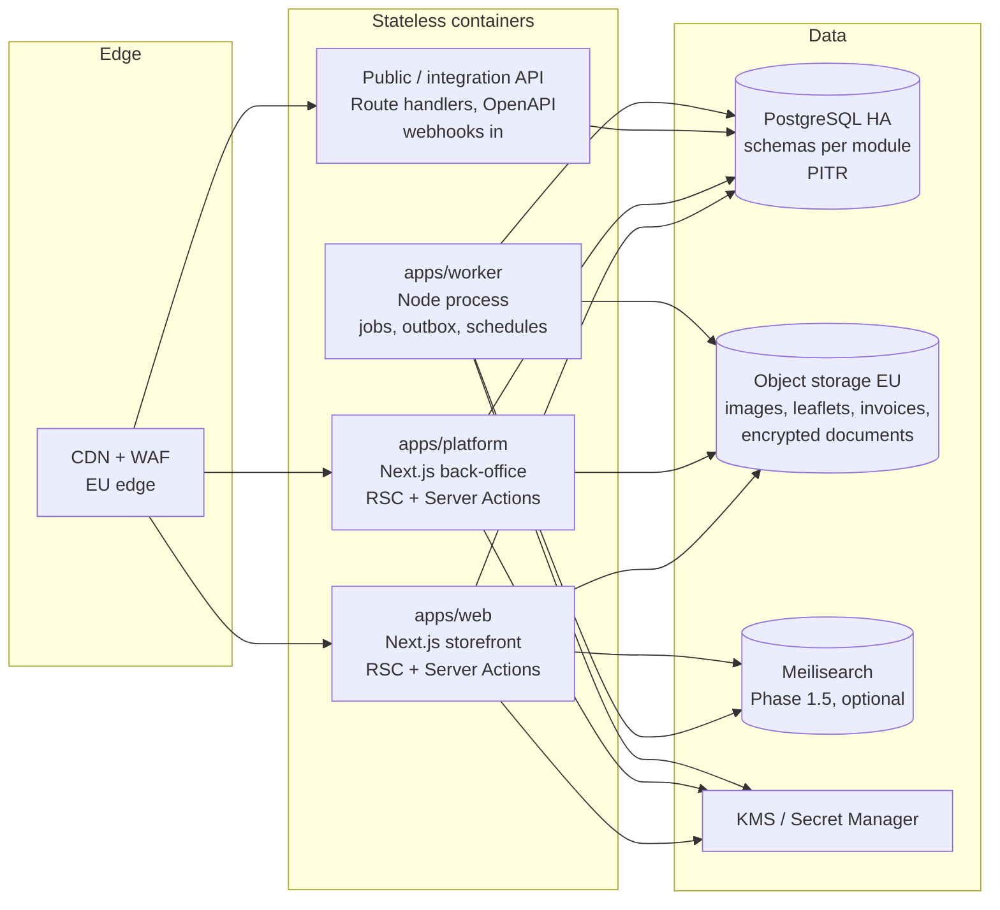
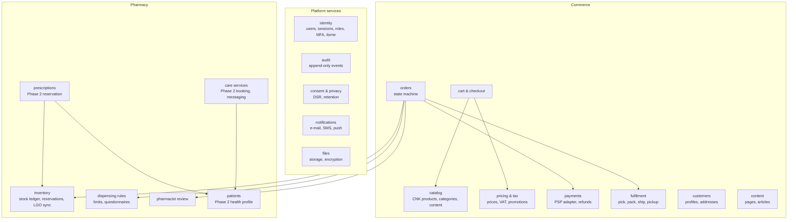
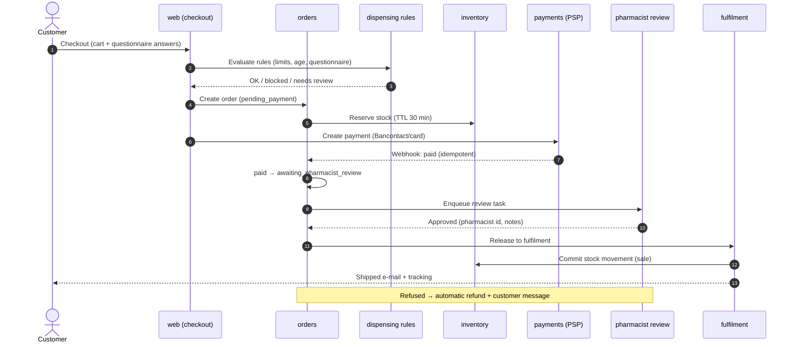
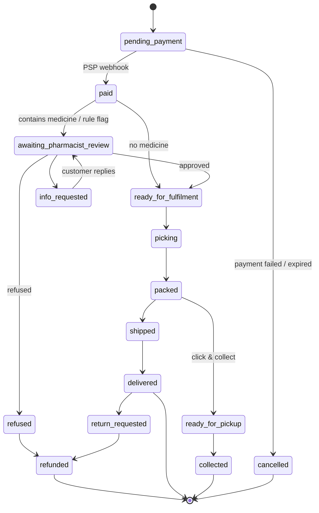

# Architecture Overview

## 1. Principles

1. **Boring, proven, few moving parts.** A small team must be able to run this at 3 a.m.
2. **Modular monolith** — strong module boundaries in code, one deployable backend, one database
   cluster. Split only when a module has a measured reason to scale or deploy independently.
3. **Postgres is the backbone** — data, jobs, outbox, full-text search (initially), audit.
4. **Compliance as code** — pharmacy rules, audit and consent are platform services, not
   afterthoughts in UI code.
5. **EU-only data path** for personal and health data.
6. **Integrate, don't rebuild** certified healthcare functions (LGO, eHealth).
7. **Type-safe end to end** — TypeScript, Zod schemas at every boundary, generated types from DB.

## 2. System context (C4 level 1)

```mermaid
flowchart TB
    customer([Customer / Patient])
    staff([Pharmacist & pharmacy staff])
    subgraph IGS[IGS-Pharma Platform]
        web[Webshop<br/>Next.js app 'web']
        platform[Pharmacy Platform<br/>Next.js app 'platform']
        core[(Core modules + PostgreSQL)]
    end
    psp[PSP<br/>Mollie / Adyen / Stripe]
    carrier[Shipping<br/>Sendcloud → bpost / PostNL / DHL]
    medipim[Medipim<br/>product content]
    sam[FAMHP SAM<br/>authentic medicines source]
    lgo[Certified pharmacy software<br/>LGO]
    ehealth[eHealth / Recip-e / GFD<br/>via LGO only]
    itsme[itsme® / eID<br/>Phase 2]
    mail[E-mail / SMS<br/>EU provider]
    peppol[Peppol access point]
    famhp[FAMHP list<br/>common logo link]

    customer --> web
    staff --> platform
    web --> core
    platform --> core
    core <--> psp
    core <--> carrier
    core <-- import --- medipim
    core <-- import --- sam
    core <--> lgo
    lgo <--> ehealth
    core <--> itsme
    core --> mail
    core --> peppol
    web -. logo link .-> famhp
```

## 3. Containers (C4 level 2)



- **apps/web** — public storefront. Mostly cached/static product & content pages (Cache
  Components / `use cache` with tag-based revalidation), dynamic cart/checkout/account.
- **apps/platform** — authenticated back-office on a separate sub-domain
  (`platform.igs-pharma.be`), IP allow-list optional, staff MFA mandatory.
- **API** — route handlers (in `platform` or a thin `apps/api`) for PSP/carrier webhooks, LGO sync
  and future partner APIs; documented with OpenAPI generated from Zod.
- **apps/worker** — long-running Node process: jobs (pg-boss / Graphile Worker), outbox relay,
  imports (Medipim, SAM, LGO), e-mails, retention, reports.

Both Next.js apps and the worker import the **same domain packages** — business logic lives in
`packages/modules/*`, never in React components.

## 4. Modules (bounded contexts)



**Module rules** (enforced with ESLint boundaries / dependency-cruiser):
- A module exposes a **public API** (`index.ts`: commands, queries, events). Other modules may
  only import that — never its tables or internals.
- Each module owns a **Postgres schema** (`catalog.*`, `orders.*`, …). Cross-module reads go
  through the public API or read-only views; cross-module writes through commands/events.
- Side-effects across modules use **domain events** via the **transactional outbox**
  (e.g. `order.paid` → inventory commits reservation, notifications send e-mail).

## 5. Key flows

### 5.1 OTC order with a medicine



### 5.2 Order state machine (simplified)



Implemented as an explicit transition table in `packages/modules/orders` (XState or a small
typed FSM) — every transition is validated, audited, and emits an outbox event.

### 5.3 Stock between shop and physical pharmacy

- **Single stock ledger** (`inventory.stock_movements`, append-only) with computed balances per
  location; **reservations** for open carts/orders.
- **Web-available stock** = on-hand − safety buffer − reservations (buffer configurable per product
  to protect walk-in patients).
- LGO sync (Phase 1): pull stock levels on schedule (e.g. every 5 min) or by webhook if the
  vendor supports it; push web sales back to LGO (API or export) so physical stock is correct.
  Fallback: robot / LGO CSV export import + manual reconciliation screen.

## 6. Cross-cutting concerns

| Concern | Approach |
|---|---|
| Caching | Next.js Cache Components with `cacheTag` per product/category; revalidate on catalogue events. CDN for static assets & images. |
| Idempotency | All webhooks and commands carry idempotency keys (`idempotency_keys` table). |
| Concurrency | Optimistic locking (`version` column) on orders/stock; `SELECT … FOR UPDATE SKIP LOCKED` for job/queue claims. |
| Time | All timestamps `timestamptz` in UTC; display in `Europe/Brussels`. |
| Money | Integer cents + currency; never floats. VAT computed per line, rounded per Belgian rules. |
| i18n | `next-intl`; locale in URL (`/nl`, `/fr`, `/de`, `/en`); translated content in DB (JSONB per locale or translation tables). |
| Feature flags | DB-backed flags (OpenFeature-compatible) — needed for phased compliance features. |
| Observability | OpenTelemetry traces/metrics/logs → Grafana stack; Sentry-compatible error tracking (EU). |
| Security | See [security architecture](security-architecture.md). |

## 7. Evolution path

| Trigger | Evolution |
|---|---|
| Catalogue > 20k SKUs or search quality issues | Add Meilisearch (EU self-hosted / managed EU) fed from outbox |
| Multiple pharmacies | `location_id` everywhere already; add per-location stock, pricing, routing |
| Heavy reporting | Read replica + materialised views; later a small warehouse (DuckDB / ClickHouse EU) |
| Partner/mobile apps | Public API hardened (OAuth 2.1 client credentials), versioned; Expo/React Native app reusing domain types |
| Independent scaling need (rare) | Extract a module behind its existing public API; outbox events already exist |
