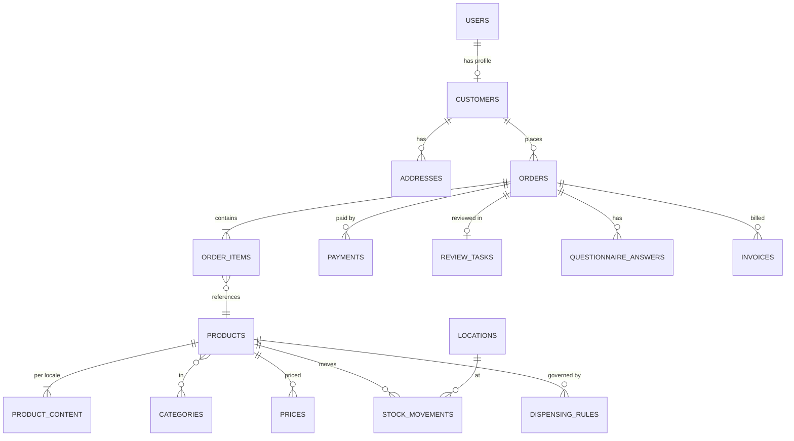

# Domain Model

Core entities per module. Each module owns a **Postgres schema**. This is the logical model —
the Drizzle schema in `packages/db` is the source of truth once implemented.

Conventions: `id uuid` (UUIDv7, time-ordered) · `created_at / updated_at timestamptz` ·
`version int` for optimistic locking · money as `amount_cents int` + `currency char(3)` ·
translations as `jsonb` keyed by locale (`{"nl": "...", "fr": "..."}`) or `*_translations` tables
for searchable fields.

## 1. identity

| Entity | Key fields |
|---|---|
| `users` | id, email (citext, unique), email_verified, name, locale, kind (`customer` / `staff`), status, identity_assurance (`none` / `email` / `itsme_high`) |
| `sessions`, `accounts`, `verifications`, `passkeys`, `two_factors` | Better Auth tables |
| `roles`, `permissions`, `role_permissions`, `user_roles` | RBAC (scoped by `location_id`) |

**Staff roles (initial):** `owner`, `pharmacist_titular`, `pharmacist`, `pharmacy_assistant`,
`fulfilment`, `customer_service`, `content_editor`, `marketing`, `accountant`, `dpo`, `admin_it`.

## 2. catalog

| Entity | Key fields |
|---|---|
| `products` | id, **cnk** (unique, 7-digit Belgian code), gtin[], product_type (`otc_medicine`, `rx_medicine`, `medical_device`, `food_supplement`, `cosmetic`, `biocide`, `general`), **legal_status** (`otc`, `rx`, `pharmacy_only`, `general_sale`), brand_id, status, vat_class, requires_pharmacist_review, age_min, cold_chain, hazardous, medipim_id, sam_amp_code |
| `product_content` | product_id, locale, name, short_description, description, usage, warnings, composition, leaflet_file_id, smpc_url, source (`medipim`/`sam`/`manual`), approved_by, approved_at |
| `product_media` | product_id, file_id, kind, sort, alt (per locale) |
| `categories` | id, parent_id, slug (per locale), name (per locale), kind (therapeutic / commercial) |
| `product_categories` | product_id, category_id |
| `brands` | id, name, slug |
| `active_substances` | id, name (INN), atc_code |
| `product_substances` | product_id, substance_id, strength | (used by quantity rules per substance) |
| `attributes` / `product_attributes` | facets (form, age group, skin type…) |

## 3. pricing & tax

| Entity | Key fields |
|---|---|
| `prices` | product_id, channel (`web`, `store`, `b2b`), amount_cents, valid_from, valid_to |
| `price_history` | product_id, channel, amount_cents, recorded_at (for 30-day reference price) |
| `vat_classes` | code (`BE_6`, `BE_21`, `BE_12`, `BE_0`), rate, valid_from |
| `promotions` | id, kind, rules jsonb, eligible_categories, **excludes_medicines** (default true), override_reason, approved_by |
| `coupons` | code, promotion_id, limits |

## 4. inventory

| Entity | Key fields |
|---|---|
| `locations` | id, name, kind (`pharmacy`, `warehouse`, `locker`), famhp_authorisation_no, address |
| `stock_movements` | id, product_id, location_id, qty (±), reason (`receipt`, `sale_web`, `sale_store`, `adjustment`, `lgo_sync`, `return`, `expiry`), batch_no, expiry_date, ref_type/ref_id, created_by — **append-only** |
| `stock_levels` | product_id, location_id, on_hand, reserved, safety_buffer, updated_at (materialised from movements) |
| `reservations` | id, product_id, location_id, qty, ref (cart/order), expires_at |
| `lgo_sync_runs` | id, direction, started_at, status, stats jsonb, errors |

## 5. customers

| Entity | Key fields |
|---|---|
| `customers` | id, user_id (nullable for guest), first_name, last_name, email, phone, birth_date (only when needed), locale, marketing_opt_in_ref |
| `addresses` | customer_id, kind, line1, line2, postal_code, city, country (BE), validated |
| `b2b_accounts` | Phase 1.5: company, VAT no., Peppol ID, payment terms |

## 6. cart & orders

| Entity | Key fields |
|---|---|
| `carts` / `cart_items` | id, customer_id/anon_id, locale, items, expires_at |
| `orders` | id, number (human, e.g. `IGS-2026-000123`), customer_id, status (see state machine), channel, locale, totals (subtotal, vat breakdown jsonb, shipping, discount, total), delivery_method, pickup_location_id, placed_at, version |
| `order_items` | order_id, product_id, cnk, name_snapshot, qty, unit_price_cents, vat_rate, legal_status_snapshot |
| `order_events` | order_id, from_status, to_status, actor_id, reason, at |
| `returns` / `return_items` | id, order_id, reason, status, refund_id |
| `invoices` | id, number (sequential, no gaps per year), order_id, pdf_file_id, peppol_status |

## 7. payments

| Entity | Key fields |
|---|---|
| `payments` | id, order_id, provider, provider_payment_id, method, amount_cents, status, raw jsonb (minimised) |
| `refunds` | id, payment_id, amount_cents, reason, status |
| `webhook_inbox` | id, provider, event_id (unique → idempotency), payload, processed_at |

## 8. pharmacy (dispensing rules & review)

| Entity | Key fields |
|---|---|
| `dispensing_rules` | id, scope (`product`, `substance`, `category`), target_id, kind (`max_qty_per_order`, `max_qty_per_period`, `age_min`, `requires_questionnaire`, `requires_review`, `block`), params jsonb, active |
| `questionnaires` / `questionnaire_questions` | id, version, per locale text, answer schema, flags (answers that trigger review/refusal) |
| `questionnaire_answers` | id, order_id, questionnaire_id, version, **answers_encrypted bytea**, key_id |
| `review_tasks` | id, order_id, status (`open`, `claimed`, `info_requested`, `approved`, `refused`), claimed_by, priority, due_at, decision_reason, decided_by, decided_at |

## 9. content (Payload CMS collections)

`pages`, `articles` (health content with `pharmacist_review` workflow), `banners`, `faq`,
`legal_documents` (versioned T&Cs / privacy — order stores the accepted version id).

## 10. platform services

| Schema | Entities |
|---|---|
| `audit` | `events` (id, at, actor_type, actor_id, action, entity_type, entity_id, location_id, ip_hash, ua_hash, data jsonb (no secrets), **prev_hash, hash**) — partitioned monthly, append-only (no UPDATE/DELETE grants) |
| `privacy` | `consents` (subject_id, purpose, granted, version, at, source), `dsr_requests`, `retention_policies`, `legal_holds` |
| `notify` | `templates`, `messages` (channel, to_hash, template, status) |
| `files` | `files` (id, bucket, key, mime, size, sha256, sensitivity, encrypted, owner_ref) |
| `system` | `outbox` (id, topic, payload, created_at, published_at), `idempotency_keys`, `feature_flags`, `pharmacy_settings` |

## 11. Phase 2 (prescriptions & care)

| Entity | Key fields |
|---|---|
| `patients` | id, customer_id, **identity_verified_at**, verification_method (`itsme`, `eid_in_store`), niss_encrypted (national number — only if legally required), reference_pharmacist (bool), consents |
| `rx_reservations` | id, patient_id, rid_codes_encrypted, status (`submitted`, `in_review`, `needs_info`, `prepared`, `ready_for_pickup`, `collected`, `cancelled`), lgo_ref, pickup_deadline, notes |
| `care_services` | id, kind (`vaccination`, `medication_review`, `new_medicine_guidance`, `screening`), duration, per locale content, price |
| `appointments` | id, patient_id, service_id, starts_at, staff_id, status |
| `message_threads` / `messages` | patient↔pharmacy secure messages, encrypted bodies, retention class |
| `refill_reminders` | patient_id, product/substance, cadence, next_at, channel, active |

## 12. ER sketch (Phase 1 core)

