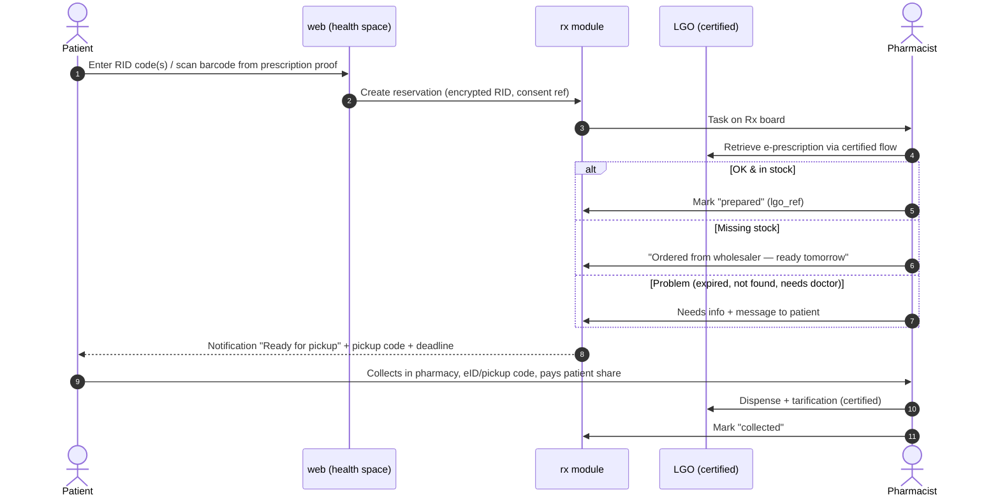
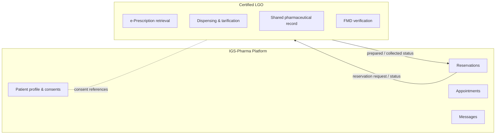

# Phase 2 — Prescriptions & Healthcare Workflows

> ⚖️ **Legal gate first.** Belgium does not permit distance sale (shipping) of prescription-only
> medicines today. Phase 2 is designed around *reservation + in-pharmacy dispensing* plus care
> services. Any home-delivery variant requires explicit legal confirmation at Gate 2.

## 1. Goals

- Let patients **reserve prescribed medicines** online and collect them prepared, without waiting.
- Strengthen the **patient–pharmacist relationship**: reference pharmacist, reminders, reviews.
- Offer **bookable care services** (vaccination, medication review, new-medicine guidance).
- Keep all certified functions inside the **LGO** ([ADR-0008](../03-architecture/adr/0008-integrate-certified-lgo-for-dispensing.md)).

## 2. Capabilities

### 2.1 Verified patient identity
- Upgrade a customer account to a **patient account** via **itsme®** (or in-store eID check by staff).
- Explicit consents per purpose (Rx reservation, reminders, messaging, reference pharmacist).
- Option to manage **family members / dependants** (children, elderly parents) with legal-basis checks ⚖️.

### 2.2 Prescription reservation ("Reserve & collect")

- Optional: patient indicates "I also want OTC products X, Y" → combined pickup basket.
- If the LGO offers an API: status updates are synchronised automatically; otherwise the
  pharmacist updates the board manually (Option C in [integrations](../03-architecture/integrations.md)).

### 2.3 Patient health space (in account)
- Active reservations and history.
- Upcoming appointments, reminders, messages.
- **Medication overview** — only if legally and technically available through the LGO and with
  consent; otherwise link to official patient portals (e.g. the national health portal / apps).
- Documents (e.g. vaccination certificates provided by the pharmacy).

### 2.4 Care services
| Service | Online part | In-pharmacy / LGO part |
|---|---|---|
| Vaccination (flu, COVID, others as allowed) | Booking, eligibility pre-check, reminders | Administration & registration via certified flows |
| Medication review / reference pharmacist | Enrolment request, booking | Clinical work in LGO |
| New-medicine guidance | Invitation & booking (2 sessions) | Counselling + record |
| Screening / measurement (blood pressure, etc.) | Booking | Measurement |
| Compression stockings, devices fitting | Booking | Fitting |

### 2.5 Secure messaging
- Patient ↔ pharmacy team threads, attachments (scanned, private), working-hours SLA,
  canned responses, escalation to phone. Not for emergencies (clear banner + 112/1733 numbers).

### 2.6 Refill reminders
- Opt-in per chronic medication; cadence from pharmacist; notification → one-click reservation.

## 3. Additional compliance & security for Phase 2

- DPIA v2; ASVS L3 controls for `care`, `rx`, `patients` schemas.
- Field-level encryption for RID codes, messages, notes; RLS strictly by patient & role.
- Every access to patient records audited; patient can see an access log of their data (nice-to-have, trust).
- Identity assurance gates every health feature.
- Retention per document type defined with counsel.

## 4. Phase 2 data flow boundaries

## 5. Phase 2 success metrics
- % of prescriptions reserved online, average wait time at pickup, reminder conversion,
  appointments booked/month, patient satisfaction, zero data-protection incidents.
