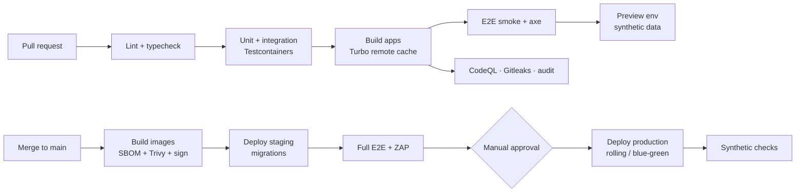

# Development Workflow

## 1. Branching & reviews

- **Trunk-based**: short-lived branches (`feat/…`, `fix/…`, `chore/…`), PR into `main`, squash merge.
- **Conventional Commits** (`feat(orders): …`) → automated changelog.
- PR requires: green CI, 1 approval (2 for `auth`, `audit`, `privacy`, `pharmacy`, `payments`,
  migrations), linked issue/requirement ID when applicable.
- `CODEOWNERS` for sensitive paths (pharmacist-titular or delegate reviews rule/questionnaire changes
  as product owner).
- Feature flags for incomplete work; no long-running feature branches.

## 2. Definition of Done

- [ ] Acceptance criteria met; requirement IDs (`REQ-…`) referenced in tests where relevant.
- [ ] Unit/integration tests; E2E for user-facing flows.
- [ ] Accessible (axe clean, keyboard tested) and translated (all 4 locales, no missing keys).
- [ ] Authorization checked in command layer; audit events for sensitive actions.
- [ ] No PII/health data in logs; telemetry added (span/metric) for new flows.
- [ ] Migrations backward-compatible; rollback considered.
- [ ] Docs updated (this folder) when behaviour/architecture changes; ADR if decision is costly to reverse.

## 3. Testing strategy

| Level | Tooling | Scope | Gate |
|---|---|---|---|
| Static | TypeScript strict, Biome/ESLint, boundaries | Everything | PR |
| Unit | Vitest | Rules engine, pricing/VAT, state machine, formatters | PR (coverage ≥ 80 % on `modules/*`) |
| Integration | Vitest + Testcontainers (Postgres) | Commands/queries with real DB, RLS policies, migrations | PR |
| Contract | Recorded fixtures / Prism mocks | PSP, Sendcloud, Medipim, LGO adapters | PR |
| E2E | Playwright | Critical journeys: browse → buy OTC; medicine with review; refusal & refund; click & collect; staff review; fulfilment | PR (smoke) + nightly (full) |
| Accessibility | axe (Playwright), Storybook a11y | Key pages & components | PR |
| Visual | Playwright screenshots / Chromatic | `packages/ui` | PR |
| Performance | Lighthouse CI, bundle size budgets | PLP, PDP, checkout | PR |
| Load | k6 | Catalogue, search, checkout | Before launch & quarterly |
| Security | CodeQL/Semgrep, Gitleaks, Trivy, ZAP baseline | Repo, images, staging | PR / nightly |

Test data: **synthetic factories** only; seeded catalogue subset with real-looking CNKs flagged as test.

## 4. CI/CD pipeline (GitHub Actions)



- Migrations run as a separate job before app rollout (expand/contract pattern).
- Production deploys during business hours only (pharmacist available), except hotfixes.
- Automatic rollback on failed health checks; release tagged with version + SBOM.

## 5. Environments

| Env | Purpose | Data | Access |
|---|---|---|---|
| Local | Dev | Docker Compose (Postgres, Mailpit, MinIO), seed data | Developers |
| Preview (per PR) | Review UI | Synthetic | Team |
| Staging | Pre-prod, UAT, pen-test target | Synthetic / anonymised; PSP & carriers in **test mode** | Team + pharmacists |
| Production | Live | Real | Restricted; break-glass DB access only |

## 6. Local setup (target)

```bash
pnpm install
cp .env.example .env            # local only — never commit secrets
docker compose up -d            # postgres, mailpit, minio
pnpm db:migrate && pnpm db:seed
pnpm dev                        # turbo: web :3000, platform :3001, worker
```

## 7. Coding standards (highlights)

- TypeScript `strict`, no `any` (lint error), exhaustive `switch` on unions.
- Zod schema = single source for input types (`z.infer`).
- Money via `Money` value object; dates via `Temporal` polyfill or `date-fns-tz` with `Europe/Brussels`.
- Server Components by default; Client Components only for interactivity; data fetching in queries.
- Errors: typed domain errors (`OrderNotReviewable`) mapped to user messages per locale.
- Logging: structured JSON via `packages/observability` logger with allow-listed fields.
- Commit generated types (Drizzle) only if needed; prefer inference.

## 8. Documentation practices

- This `docs/` folder is the single source of truth for plans, architecture and compliance mapping.
- Diagrams in Mermaid (rendered by GitHub).
- ADR for decisions; runbooks under `docs/07-operations/runbooks/` (to be created in Phase 1c).
