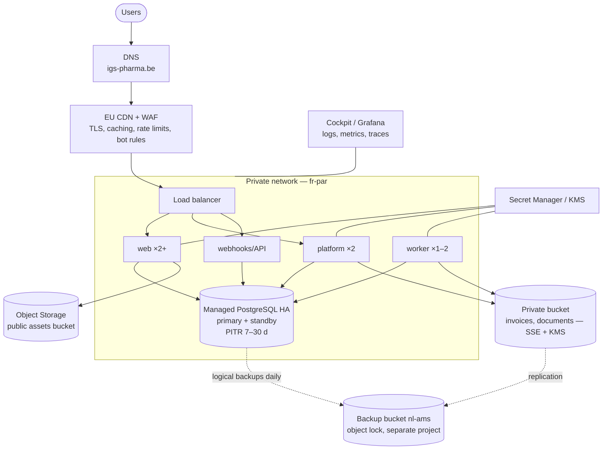

# Infrastructure & Hosting

## 1. Target topology (recommended: Scaleway, fr-par primary, nl-ams secondary)

- **Compute**: Serverless Containers (simplest) or Kapsule (managed Kubernetes) if more control
  is needed later. Start with containers; min 2 instances for `web` and `platform`.
- **Database**: Managed PostgreSQL, HA, private network only, automated backups + PITR, plus a
  daily logical dump (`pg_dump`, encrypted) to an immutable bucket in another region/project.
- **Object storage**: public bucket (product images via CDN), private buckets (invoices,
  leaflets cache, Phase 2 documents) with server-side encryption and signed URLs.
- **Secrets**: Secret Manager; KMS for envelope encryption keys.
- **E-mail**: EU transactional provider with SPF, DKIM, DMARC (`p=reject` after warm-up).
- **Equivalent on OVHcloud**: Managed Kubernetes or Web PaaS, Managed Databases for PostgreSQL,
  Object Storage, KMS; HDS-certified offers available if Phase 2 counsel requires stricter hosting.

## 2. Environments & isolation

- Separate cloud **projects** for `staging` and `production` (separate IAM, networks, keys).
- Backups in a **third project** with write-only credentials from production (ransomware resilience).
- Infra entirely in **OpenTofu**; manual console changes prohibited (drift detection weekly).

## 3. Sizing (launch) & indicative monthly costs

> Indicative ranges (excl. VAT) for planning only — get quotes in Phase 0.

| Item | Launch sizing | € / month |
|---|---|---|
| Containers (web ×2, platform ×2, worker ×1) | 1 vCPU / 2 GB each, autoscale web to 6 | 80 – 250 |
| Managed PostgreSQL HA | 2–4 vCPU, 8–16 GB RAM, 50–100 GB SSD | 200 – 450 |
| Object storage + egress | < 200 GB | 10 – 40 |
| CDN + WAF | EU CDN | 20 – 100 |
| Observability (logs/metrics/traces, error tracking) | 30-day retention | 0 – 150 |
| E-mail + SMS | 20k e-mails, 2k SMS | 40 – 150 |
| Meilisearch (Phase 1.5) | Small instance | 30 – 80 |
| Synthetic monitoring / uptime | | 0 – 50 |
| **Infra total** | | **≈ 400 – 1 250** |

Not included: PSP fees (per transaction), Medipim subscription, Sendcloud plan + postage, itsme®
fees (Phase 2, per authentication), domain names, pen-tests, legal.

## 4. Availability & resilience targets

| Metric | Target |
|---|---|
| Storefront availability | 99.9 % / month |
| Back-office availability | 99.5 % in opening hours |
| **RPO** (data loss) | ≤ 15 min (PITR); ≤ 24 h for cross-region logical backup |
| **RTO** (restore) | ≤ 4 h full region loss; ≤ 30 min single-instance failure (automatic) |

Degraded modes:
- PSP down → checkout shows "payment temporarily unavailable", cart preserved; alternative PSP method if configured.
- Carrier API down → orders queue for label creation; pickup unaffected.
- LGO sync down → web stock frozen with larger safety buffer; alert to pharmacist; manual reconciliation.
- Search down → fall back to Postgres FTS.

## 5. Domains & DNS

- `igs-pharma.be` (primary), consider `igs-pharma.com` and language-neutral redirects.
- `platform.igs-pharma.be` (back-office), `api.igs-pharma.be` (webhooks/integrations),
  `status.igs-pharma.be` (status page).
- DNSSEC, CAA records, HSTS preload after stabilisation.
- The **exact URL registered with the FAMHP** must match the live domain — changes require notification.
